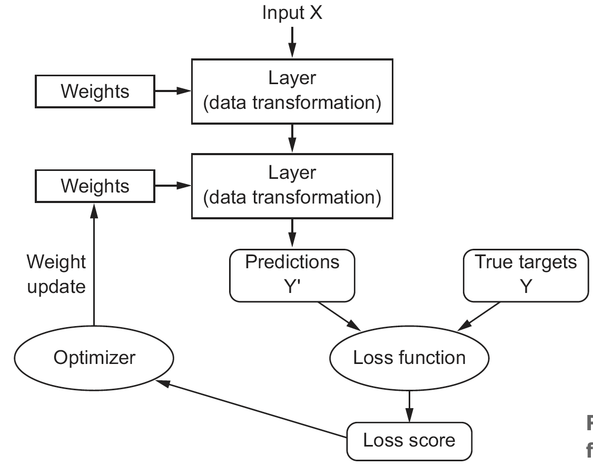

```{r setup2,include=FALSE,eval=TRUE}
knitr::opts_chunk$set(echo = TRUE
                      ,message = FALSE
                      ,eval = FALSE
                      ,error = FALSE
                      ,warning = FALSE
                      ,strip.white = FALSE #To remove white space before and after chunk in output
                      ,fig.align = 'center'
                      ,fig.width = 7.5
                      )
```

# Deep Learning Fundamentals

## Basic Deep Learning

The reason we call it deep learning, is that the method apply many levels where the data is manipulated and wrangled to attempt to extract meaning behind the input data. All the layers are increasingly different from the input data. In the book the apply the analogy, *that one can think of this as a multistage way to learn data representations [@chollet2018, p 9].*

The overall process and list of tasks to do is very similar to what we know from machine learning. It goes:

{#feedbackcycle width="414"}

Hence we see that first we train the model, then validate. Based on the validation to the true targets we assess the appropiate loss function and then optimize each weight of the layers.

The model starts in practice with random weights and then starts mutating to see if the loss function is optimized, at a certain point, one may say, that the model should not be altered any more.

Therefore, we still see that the bias-variance-tradeoff still applies and thus also train optimism, which one has to look out for.

### Terms

+-------------------+-----------------------------------------------------------------------------------------------------------------------------------------------------------------------------------------------------------------------------------------------------------------------------------------------------------------------------------------------------------------------------------------------------------------------------------------------------+
| Term              | Definition                                                                                                                                                                                                                                                                                                                                                                                                                                          |
+===================+=====================================================================================================================================================================================================================================================================================================================================================================================================================================================+
| Tensor            | We have tensors in n-dimensions, e.g.:                                                                                                                                                                                                                                                                                                                                                                                                              |
|                   |                                                                                                                                                                                                                                                                                                                                                                                                                                                     |
|                   | 1.  0 dimensional, this is practically a scalar                                                                                                                                                                                                                                                                                                                                                                                                     |
|                   | 2.  1 dimensional, what we know as a vector                                                                                                                                                                                                                                                                                                                                                                                                         |
|                   | 3.  2 dimensional, what we know as matrices, hence we have rows and columns                                                                                                                                                                                                                                                                                                                                                                         |
|                   | 4.  3 dimensional, now we have an array                                                                                                                                                                                                                                                                                                                                                                                                             |
|                   | 5.  4 dimensional, get more difficult to draw. e.g., collection of images.                                                                                                                                                                                                                                                                                                                                                                          |
|                   | 6.  5 dimensional, even more difficult, e.g., video. See example on [@chollet2018, p.34]                                                                                                                                                                                                                                                                                                                                                            |
+-------------------+-----------------------------------------------------------------------------------------------------------------------------------------------------------------------------------------------------------------------------------------------------------------------------------------------------------------------------------------------------------------------------------------------------------------------------------------------------+
| Axis              | A each **dimension** in a tensor is also called an **axis**.                                                                                                                                                                                                                                                                                                                                                                                        |
+-------------------+-----------------------------------------------------------------------------------------------------------------------------------------------------------------------------------------------------------------------------------------------------------------------------------------------------------------------------------------------------------------------------------------------------------------------------------------------------+
| Array             | This is when you accumulate data in scalars, matrices or 3d tensor. Hence you have several 'pages' or chunks. E.g., if you have an image with 28 pixels. Then each picture is a matrix 28x28. Then if you have several matrices, then you create an array of three dimension.                                                                                                                                                                       |
|                   |                                                                                                                                                                                                                                                                                                                                                                                                                                                     |
|                   | You can also have three dimensional data and e.g., when collected over time it constructs a 4 dimensional array **i.e. 4D Tensor, i.e. tensor with 4 axis'**.                                                                                                                                                                                                                                                                                       |
|                   |                                                                                                                                                                                                                                                                                                                                                                                                                                                     |
|                   | With video data, you will actually get a 5D tensor.[^deeplearningfundamentals-1]                                                                                                                                                                                                                                                                                                                                                                    |
+-------------------+-----------------------------------------------------------------------------------------------------------------------------------------------------------------------------------------------------------------------------------------------------------------------------------------------------------------------------------------------------------------------------------------------------------------------------------------------------+
| Rank              | = number of axis' in a tensor                                                                                                                                                                                                                                                                                                                                                                                                                       |
+-------------------+-----------------------------------------------------------------------------------------------------------------------------------------------------------------------------------------------------------------------------------------------------------------------------------------------------------------------------------------------------------------------------------------------------------------------------------------------------+
| Batch             | i.e., samples axis, i.e., samples dimension. DL does not process all data at once hence you load through batches. hence a 3D tensor will could have a batch of `train_images[1:128,,]`                                                                                                                                                                                                                                                              |
+-------------------+-----------------------------------------------------------------------------------------------------------------------------------------------------------------------------------------------------------------------------------------------------------------------------------------------------------------------------------------------------------------------------------------------------------------------------------------------------+
| Class             | These are the categories in the scenario.                                                                                                                                                                                                                                                                                                                                                                                                           |
+-------------------+-----------------------------------------------------------------------------------------------------------------------------------------------------------------------------------------------------------------------------------------------------------------------------------------------------------------------------------------------------------------------------------------------------------------------------------------------------+
| Sample            | These are the data points                                                                                                                                                                                                                                                                                                                                                                                                                           |
+-------------------+-----------------------------------------------------------------------------------------------------------------------------------------------------------------------------------------------------------------------------------------------------------------------------------------------------------------------------------------------------------------------------------------------------------------------------------------------------+
| Label             | This is the specific class of each sample.                                                                                                                                                                                                                                                                                                                                                                                                          |
+-------------------+-----------------------------------------------------------------------------------------------------------------------------------------------------------------------------------------------------------------------------------------------------------------------------------------------------------------------------------------------------------------------------------------------------------------------------------------------------+
| Weights           | These are the **trainable parameters** that are assigned to the each layer in the learner, see [\#feedbackcycle](#feecbackcycle).                                                                                                                                                                                                                                                                                                                   |
+-------------------+-----------------------------------------------------------------------------------------------------------------------------------------------------------------------------------------------------------------------------------------------------------------------------------------------------------------------------------------------------------------------------------------------------------------------------------------------------+
| mini-SGD          | The mini-batch stochastic gradient descent. This is an approach to iteratively alter the weights for the layers and then gradually decent towards a lower loss. As with gradient boosting, we can apply the same analogy and control how much the learner is changing at each iteration. Hence big chunks, then we may require fewer iterations and less computation, but we may also miss a dip, or the descent may get completely out of control. |
+-------------------+-----------------------------------------------------------------------------------------------------------------------------------------------------------------------------------------------------------------------------------------------------------------------------------------------------------------------------------------------------------------------------------------------------------------------------------------------------+
| Densely connected | This is a fully connected network where all neurons in the adjacent layers are connected.                                                                                                                                                                                                                                                                                                                                                           |
+-------------------+-----------------------------------------------------------------------------------------------------------------------------------------------------------------------------------------------------------------------------------------------------------------------------------------------------------------------------------------------------------------------------------------------------------------------------------------------------+
| Epochs            | The amount of iterations over all samples in the train tensors. Notice that each epoch (iteration) can run in several batches.                                                                                                                                                                                                                                                                                                                      |
+-------------------+-----------------------------------------------------------------------------------------------------------------------------------------------------------------------------------------------------------------------------------------------------------------------------------------------------------------------------------------------------------------------------------------------------------------------------------------------------+
| Forward Pass      | This is the first time you build the model. This often selects random weights for each of the layers                                                                                                                                                                                                                                                                                                                                                |
+-------------------+-----------------------------------------------------------------------------------------------------------------------------------------------------------------------------------------------------------------------------------------------------------------------------------------------------------------------------------------------------------------------------------------------------------------------------------------------------+
| Backward Pass     | This is when we have built the model and now we want to update the weights to reduce the loss.                                                                                                                                                                                                                                                                                                                                                      |
+-------------------+-----------------------------------------------------------------------------------------------------------------------------------------------------------------------------------------------------------------------------------------------------------------------------------------------------------------------------------------------------------------------------------------------------------------------------------------------------+
| Backpropagation   | This is the concept of updating the weights. For this, one must be aware of the term - *momentum*.                                                                                                                                                                                                                                                                                                                                                  |
+-------------------+-----------------------------------------------------------------------------------------------------------------------------------------------------------------------------------------------------------------------------------------------------------------------------------------------------------------------------------------------------------------------------------------------------------------------------------------------------+
| Momentum          | For the backpropagation, the momentum is the thrust of the descent. This is an attempt to find the global minimu, so we don't get stuck at a local minimum.                                                                                                                                                                                                                                                                                         |
+-------------------+-----------------------------------------------------------------------------------------------------------------------------------------------------------------------------------------------------------------------------------------------------------------------------------------------------------------------------------------------------------------------------------------------------------------------------------------------------+
| Identity function | This is merely a function the entirely replicates the training data.                                                                                                                                                                                                                                                                                                                                                                                |
+-------------------+-----------------------------------------------------------------------------------------------------------------------------------------------------------------------------------------------------------------------------------------------------------------------------------------------------------------------------------------------------------------------------------------------------------------------------------------------------+
|                   |                                                                                                                                                                                                                                                                                                                                                                                                                                                     |
+-------------------+-----------------------------------------------------------------------------------------------------------------------------------------------------------------------------------------------------------------------------------------------------------------------------------------------------------------------------------------------------------------------------------------------------------------------------------------------------+

: Terminology

[^deeplearningfundamentals-1]: Rules of thumb for how many dimensions to get, see [@chollet2018, p 32]

Tensors:

4D: that is for instance pictures, we see that we have a height, width and the color channels (RGB channels) and then you have n sets of these. Hence if you had 100 pictures, then you have 100 times 3 slices, one for each of the color channel. See it graphically below.

{width="305"}

5D: These are represented as arrays and this captures video data.

### Optimizers, Loss, Metrics and Activation rules

As written previously, we want to mimize the loss and thus optimally find the global minimum, although that is often easier said than done. If we are working with only few layers, e.g. N = 3, then the minimum can analytically be derived, but in practice one will often have thousands of layers. Hence it gets practically impossible. Therefore, we attempt to lower the loss gradually, as quick as possible/reasonable, while still preserving control over the descent.

Loss function is also called the objection function.

To minimize the loss, we apply **optimizers**, these are examples:

1.  Momentum
2.  Adagrad
3.  RMSProp
4.  And others

The **loss** that we want to minimize, examples:

1.  Binary Crossentropy. Often applied in a binary prediction setting. This is very much applied when you want to account for the probability of class 0 or 1, hence if you predict 0.45 and 0.1 (indicating that it will be class 0), then the 0.1 will lead to a bigger penalty than the 0.45 level. Compared to for instance accuracy, where you are either right or wrong.
2.  Mean Squared error.
3.  Categorical crossentropy, used in a multiclass setting, where classes are one-hot encoded.
4.  Sparse Categorical Crossentropy, used in a multiclass setting, where classes are assigned a number, sort of an ID.
5.  Mean absolute error.

**Metrics:**

*This is merely an additional metric, that one wants to track, but it is not intended to optimize against.*

1.  Accuracy
2.  Metric Binary accuracy

**Activation rules:**

*Activation rules are what makes the NNET dynamic. They also directly influence the output of the layer and one can use different activation in each layer. Here are some examples:*

1.  Relu: very commonly used, rules

2.  Sigmoid: grants probabilities similar to logistic regression

3.  Elu

4.  Prely

5.  Tanh

#### Gradient Descents

This is about finding the global minimum in the loss. We have three approaches to this:

1.  Batch Gradient Descent: This use all the data

2.  Stochastic Gradient Descent: This use only single observations

3.  Mini-batch Gradient Descent: This is more of a hybrid, where we must specify the batch size. This also introduce a new hyperparameter, that we can tune the model with.

    1.  We often see that the batch size is \$2\^s\$, as that will lead to 32, 64, 128 etc. that fits computer memory very well.

    2.  Notice, that this is not epochs. The difference between this and epochs, is that epochs decide how many times we will circulate the training set.

### Example with image recognizion

*This is based on [@chollet2018, ch. 2.5.].*

```{r}
library(keras)
mnist <- dataset_mnist()
```

```{r}
train_images <- mnist$train$x
train_labels <- mnist$train$y
test_images <- mnist$test$x
test_labels <- mnist$test$y

train_images <- array_reshape(train_images, c(60000, 28 * 28))
train_images <- train_images / 255
test_images <- array_reshape(test_images, c(10000, 28 * 28))
test_images <- test_images / 255
train_labels <- to_categorical(train_labels)
test_labels <- to_categorical(test_labels)
```

### Model building

There are three steps:

**Step 1: Define**

```{r}
library(tidyverse)
network <- keras_model_sequential() %>% #We create a sequential NNet.
  layer_dense(units = 512 #The hidden layer
              ,activation = "relu"
              ,input_shape = c(28 * 28)) %>% 
  layer_dense(units = 10 #The final layer
              ,activation = "softmax")
```

A sequencial model:

{width="262"}

We see that the pipe operater creates the two layeres. This is the most common type of neural network.

`layer_dense()` is creating a *fully connected network*. Menaing that we see that each neurons are connected to each of the neurons.

*It is also a feed forward neural network,* meaning that it is going forward, it cannot go backwards.

Notice that the last `layer_dense()` will be the output layer, and then all layers before that, are hidden networks.

We see that the hidden layers are one of the tuning parameters and try to find out by tuning. This is very much engineering and not very theory heavy. It is key to experiment and test you way forward.

***Then what can we put into each layer?***

-   Units: That is the number of nodes (neurons) in the layer. [This is a tuning parameter!]{style="color: red"}. *Notice that if the layer is the last layer*, hence the output, then the amount of neurons must mach the amount of categories that we want to predict. Examples:

    -   If we have a continous variable, then we have units = 1

    -   If we have a binary variable, then we have units = 2

    -   If we want to categorize numbers 0 - 9, then units = 10

-   Activation: We see that we use relu above. When data goes through a node, it goes through two steps:

    -   Relu:

        -   <div>

            1.  Linear transformation. This assigning some weights to each of the variables. We also have a constant called *bias*, but it is not like bias variance tradeoff as we know it. The operations are very similar to linear regression, when you zoom into each note. This score will then be passed on to the `relu` function. This makes sense as the show with momentum in the book, where it gets an idea of whether you are going up or down on the loss.
            2.  Activation function, here we see `relu`, it says that, if the input is below 0 (negative), then return 0, but if it is positive, then it returns the value itself. That is extremely simple but works really well. [This can very often be the default to use.]{style="color: red"} Hence this is going to decide neuron is going to ignite, and then it defines 'by how much'. Then this will get passed on to the following node. And the higher the number for Relu, the larger is the probability for the next node is also going to ignite. *Notice that this is based on the score from step 1.*

            </div>

    -   Softmax: This is basically generalization of logistic regression, but where we have more than 2 outcomes. With this we get probabilities out, where ALL of the outcomes sum to 1. This is the default for the multi-class setting.

    -   Sigmoid: When we have a binary outcome. sigmoid is the s-curve we see, e.g., with logistic regression. So we get something on the probability scale.

    -   Null: When we have a regression setting, i.e., continous variable.

-   Input_shape:

***Then what happens in each layer?***

It basically unfolds the complicated data and Jesper used origami to visualize how we unfold the figure to see the original shape of the figure.

**Step 2: Compile**

```{r}
network %>% compile(
  optimizer = "rmsprop",
  loss = "categorical_crossentropy",
  metrics = c("accuracy")
)
```

We see that the loss is the categorical_crossentropy. This measure is going to define how far the predicted values and actual values are from each other.

**Step 3: Train**

```{r}
network %>% fit(train_images, train_labels, epochs = 5, batch_size = 128)
```

```{r}
metrics <- network %>% evaluate(test_images, test_labels)
metrics
```

### Validating the model

One should always use a hold-out sample both consisting of a validation and a test. If we want a really good estimate of the out-of sample performance, then we want to go for a large test set, but it will also take out a lot of information that the model can learn from.

If we want to validate using all of the train data, we can estimate the out of sample using cross-validation. If we don't have much data, then we can use iterated k-fold cross validation. Although, using iterated k-fold CV is often a symptom of having too little data.

### Overfitting / Underfitting

As with any other learner we are interested in making the right fit to the data, but when is that?

We know that adding complexity also adds more assumptions and possibility of overfitting to the training data. But without some complexity in the model, we see that the learner will not learn enough.

Hence the question is, how are we able to introduce complexity to the model without overfitting to the train data, and perhaps enabling the model to merely memorize the train data. In general we have three themes that we can tune and introduce to the model, namely hyperparameters and regularization. Outside of the model, we can also play around with the variables through feature engineering.

Notice that whenever we are trying to fight overfitting, then we make learning obstacles, so it is more difficult for the model to learn, hence we will often need more epochs.

#### Hyperparameters:

We have a wide range of hyperparameters that we are able to tune to optimize the model. For instance:

1.  Adding / removing layers
2.  Adjusting amount of units, but remember the rule of thumb, that it should either be a funnel or a tunnel.

#### Regularization:

As we know from any other machine learning, we have regularization methods, that deal with overfitting in a high dimensional space.

1.  L1 Regularization: The cost is added proportion to *the absolute value* of the the weight coefficients.*Recall that the weight coefficients decide the effect of the layers. This is an iterative process.* This is similar to Lasso, hence the weights can be exactly 0.
2.  L2 Regularization: The cost added is proportional to the *square of the value of the coefficients*. This is also called *weight decay (but only in context of neural networks)*. This is similar to Ridge Regression, where the weights can be set to close to 0.
3.  L1 L2 Regularization: We can also introduce an L1 and L2 regularization, which is similar to the elastic net.

::: {.lightgreybox}
In R, this is called by the \`kernel_regularizer = 'regularizer_l2' or 'regularizer_l1'\`
:::

Thus in the fitting process when introducing regularization each weight will add more penalty to the loss, hence in the training process one constrains the model to overfit to the training data as the weights will add a loss.

So in principle, when we add penalty, we make it harder for the model to learn, hence it leads to one must use more epochs.

#### Dropout

We see that we add an artificial layer in the network, that is the dropout. This layer will then in the train process randomly remove neurons and in the test run, it will scale neurons randomly.

The purpose is to intentionally introduce noise in the model to prevent the network to simply memorize the data.

The analogy from the developers of the method is that in the bank they are often changing the tellers at the desk. The reason is that we need different people to deal with the customers and perhaps detect fraud, so a potential fraudulent person can't plan out what teller to address. Hence we introduce an element of randomness.

Visually it looks like this:


#### Then how do we control for a good fit?

One must intentionally overfit, or intentionally start underfitting, to then start tampering up or down.

### Dealing with missing data

We see that we are able to encode missing data correctly, then the network is able to identify that there is data missing and can learn from that.

## The workflow for building the neural network

It is a seven step process.

1.  Identify the problem

2.  Choosing the measure of success / loss function and optimizer, for example:

{width="456"}

3.  Deciding on an evaluation protocol: e.g.,

    1.  K-fold CV,

    2.  hold-out validation set,

    3.  doing iterated K-fold CV. Often used when little data is available.

{width="423"}

One must select the correct method. The optimal is the often the hold-out, but one must consider the evaluation thoroughly, all conclusions are based on this, as the model will be poor.

4.  Preparing the data in tensors, see rules of thumb [@chollet2018, p.g 104]

5.  Developing the model. Remember to compare with the baseline, e.g., by predicting the most dominant class, if we are in a classification setting.

    1.  Also this is about setting the right activation for the last layer.

    2.  

    3.  The reason that we are comparing to the baseline (e.g., a model in production or a random guess), is that we want to compare to the simplest model and that is very often just a doing something randomly.

6.  Scaling up: develop a model that overfits the data and then is able to learn a lot from the train data. The reason is that to know when you are overfitting, you must start out big to know where the threshold is.

    1.  Add layers

    2.  Make the layers bigger

    3.  Train for more epochs

7.  Adding regularization to the model and tuning hyperparameters. This is often where we spend the most time. Remember not to run it on the test set before the very end. Examples of what can be done:

    -   Add dropout
    -   Add or remove layers
    -   Add L1 and/or L2 regularization
    -   Try different hyperparameters (units, learning rate, etc.)
    -   Go back to feature engineering: add new features or remove layers

    1.  One can use some callback function to make the model stop if the model is not improving.

### Being aware of the process

it is important to pay attention and always reflect on the choices that were made, and refelct upon whether they were correct or not.

## When Neural Networks will fail

There are different problems where the neural networks will certainly not outperform more simple methods. For example:

-   When there is more noise than signal, then the network will learn the noise and not the signals.

### Hyper parameter tuning

See the grid_search.R file